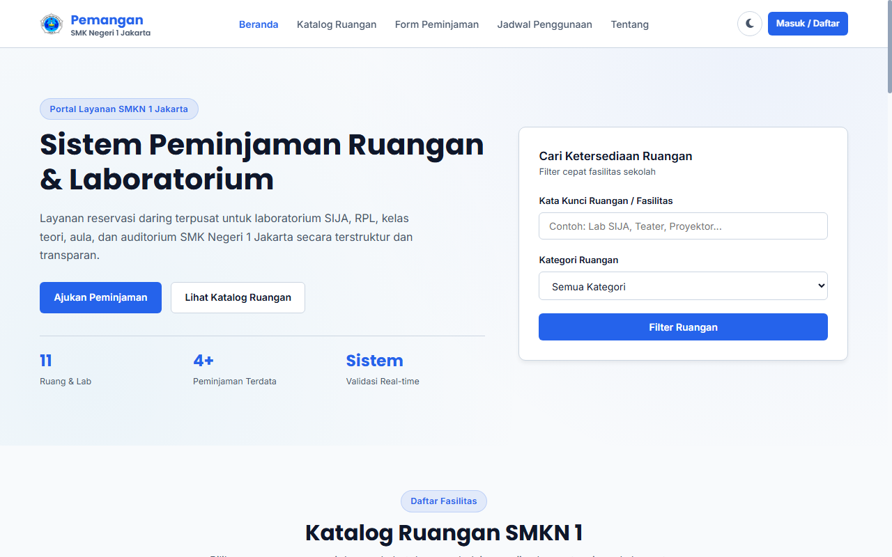
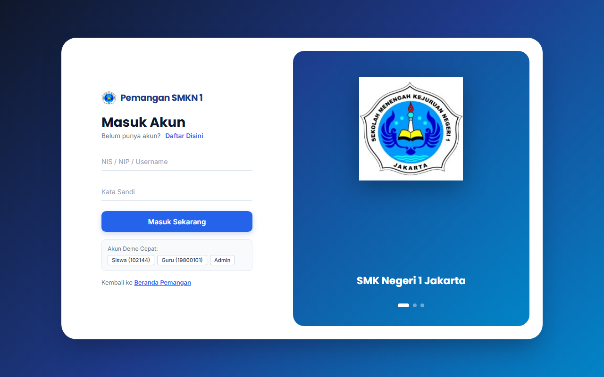
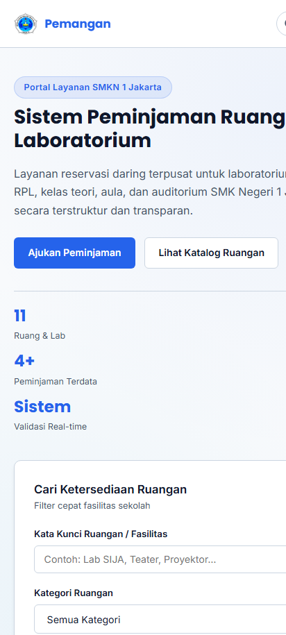

# Pemangan — Sistem Informasi Peminjaman Ruangan & Lab SMKN 1 Jakarta

Platform terintegrasi pengelolaan dan reservasi fasilitas ruangan, laboratorium komputer, dan auditorium di SMK Negeri 1 Jakarta secara transparan, terstruktur, dan bebas konflik jadwal.

---

## Pratinjau Antarmuka

### 1. Beranda & Katalog Fasilitas (Desktop)


### 2. Autentikasi Pengguna & Pilihan Akun (Sign-in / Sign-up)


### 3. Tampilan Responsif Smartphone (Mobile View)


---

## Fitur Utama

- **Katalog Fasilitas Lengkap:** 11 data ruangan aktif meliputi Lab SIJA, Lab RPL, Ruang Teater Audio Visual, Aula GSG, Ruang Rapat Guru, dan Ruang Teori Gedung Baru/Lama.
- **Penyaringan & Pencarian Instan:** Filter kategori instan (Laboratorium, Gedung Baru, Gedung Lama, Teater, GSG) dan pencarian berbasis fasilitas/spesifikasi.
- **Validasi Anti-Bentrok Jadwal:** Pengecekan otomatis ketersediaan ruangan pada rentang tanggal dan jam yang diajukan untuk mencegah tabrakan reservasi.
- **Surat Izin Resmi Siap Cetak:** Format surat peminjaman resmi ber-KOP Dinas Pendidikan & SMKN 1 Jakarta yang dapat langsung dicetak atau disimpan sebagai dokumen PDF.
- **Manajemen Berbasis Peran (RBAC):**
  - **Siswa:** Mengajukan reservasi, memantau antrean, dan mengunduh surat izin.
  - **Guru:** Pengajuan prioritas KBM dan hak persetujuan kegiatan bimbingan.
  - **Admin Sarpras:** Panel persetujuan, penolakan dengan catatan, dan pemeliharaan jadwal sekolah.
- **Penyimpanan Lokal Persisten:** Manajemen state, data pengguna, katalog ruangan, dan riwayat permohonan menggunakan *Storage Service* berbasis LocalStorage.
- **Desain Adaptif & Dark Mode:** UI berbasis CSS design tokens dengan dukungan mode terang/gelap serta navigasi drawer mobile yang ergonomis.

---

## Struktur Proyek

```
Pemangan/
├── index.html            # Halaman utama (Hero, Katalog, Form Reservasi, Panel Sarpras)
├── style.css             # Desain sistem, token tema, layout grid/flexbox, print CSS
├── script.js             # Logika interaktivitas, drawer navigasi, modal, validasi jadwal
├── data.js               # Dataset awal sekolah, akun pengguna, & StorageService engine
├── login/
│   ├── login.html        # Halaman autentikasi (Sign-In, Sign-Up, Demo switcher)
│   ├── login.css         # Styling split-screen & animasi form interaktif
│   └── login.js          # Validasi login, registrasi akun, & sinkronisasi sesi
├── img/                  # Aset logo dan gambar dokumentasi ruangan sekolah
└── docs/
    └── screenshots/      # Dokumentasi visual antarmuka sistem
```

---

## Akun Demo Pengujian

Sistem menyediakan akun siap pakai untuk verifikasi alur kerja peran:

| Peran | NIS / NIP / Username | Kata Sandi | Deskripsi Hak Akses |
|---|---|---|---|
| **Siswa** | `102144` | `123` | Pengajuan reservasi & unduh surat izin |
| **Guru** | `19800101` | `guru` | Pengajuan dan akses Panel Kelola Sarpras |
| **Admin** | `admin` | `admin` | Pengelolaan penuh permohonan & status peminjaman |

---

## Cara Menjalankan Secara Lokal

1. **Clone repository:**
   ```bash
   git clone https://github.com/h1ntz0/Pemangan.git
   cd Pemangan
   ```

2. **Jalankan web server lokal:**
   - Menggunakan Python:
     ```bash
     python3 -m http.server 8080
     ```
   - Menggunakan Node.js (`npx`):
     ```bash
     npx serve .
     ```
   - Atau buka file `index.html` langsung di peramban web modern (Google Chrome, Mozilla Firefox, Microsoft Edge).

3. **Buka di Browser:**
   Akses `http://localhost:8080` untuk melihat portal utama atau `http://localhost:8080/login/login.html` untuk masuk ke akun.

---

## Tim Pengembang

- **Pengembang:** Arrofi Zein & Rasya Aryasatya (XI SIJA — SMK Negeri 1 Jakarta)
- **Guru Pembimbing:** Pak Amrul Khairullah, S.Kom
- **Program:** Proyek Kreatif & Kewirausahaan (PKK) Bidang Keahlian Sistem Informatika, Jaringan & Aplikasi
