<div align="center">


# 🏛️ PEMANGAN
### **Sistem Informasi Peminjaman Ruangan & Laboratorium Kejuruan**
**SMK Negeri 1 Jakarta — Pusat Keunggulan (Center of Excellence)**

[](https://pemangan.vercel.app)
[](https://react.dev/)
[](https://www.typescriptlang.org/)
[](https://vitejs.dev/)
[](https://tailwindcss.com/)
[](https://playwright.dev/)

<br />

> **Solusi terintegrasi reservasi 13 fasilitas laboratorium komputer kejuruan, studio multimedia, aula serbaguna, dan ruang teori SMK Negeri 1 Jakarta dengan penjadwalan bebas bentrok (*zero-conflict*), pelacakan tiket instan, dan surat izin kedinasan ber-QR Code.**

<br />

[🌐 **Buka Aplikasi Live (Vercel)**](https://pemangan.vercel.app) &nbsp;•&nbsp;
[📑 **Alur Peminjaman**](#-alur-kerja-sistem) &nbsp;•&nbsp;
[🏢 **Katalog Ruangan**](#-katalog-fasilitas-ruangan-13-ruangan-aktif) &nbsp;•&nbsp;
[🔑 **Akun Demo**](#-akun-demo-pengujian-instan) &nbsp;•&nbsp;
[🚀 **Panduan Deploy**](#-panduan-instalasi--deployment)

---

</div>

## 📌 Daftar Isi
- [Tentang Pemangan](#-tentang-pemangan)
- [Fitur Unggulan](#-fitur-unggulan)
- [Pratinjau Visual Antarmuka](#-pratinjau-visual-antarmuka)
  - [1. Tampilan Desktop (Web Browser)](#1-tampilan-desktop-web-browser)
  - [2. Tampilan Mobile (Smartphone)](#2-tampilan-mobile-smartphone)
- [Alur Kerja Sistem](#-alur-kerja-sistem)
- [Arsitektur & Tech Stack](#-arsitektur--tech-stack)
- [Katalog Fasilitas Ruangan (13 Ruangan Aktif)](#-katalog-fasilitas-ruangan-13-ruangan-aktif)
- [Akun Demo Pengujian Instan](#-akun-demo-pengujian-instan)
- [Struktur Direktori Proyek](#-struktur-direktori-proyek)
- [Panduan Instalasi & Deployment](#-panduan-instalasi--deployment)
  - [A. Deployment ke Vercel (Production)](#a-deployment-ke-vercel-production)
  - [B. Menjalankan Lokal (Development)](#b-menjalankan-lokal-development)
  - [C. Nginx Reverse Proxy (Server Fisik / Intranet Sekolah)](#c-nginx-reverse-proxy-server-fisik--intranet-sekolah)
- [Pengujian Otomatis (Playwright E2E)](#-pengujian-otomatis-playwright-e2e)
- [Standar Dokumen & Legalitas Cetak](#-standar-dokumen--legalitas-cetak)
- [Tim Pengembang](#-tim-pengembang)

---

## 💡 Tentang Pemangan

**PEMANGAN** (*Peminjaman Ruangan*) hadir untuk mentransformasi tata kelola sarana dan prasarana di **SMK Negeri 1 Jakarta**. Sebelum sistem ini diimplementasikan, proses peminjaman laboratorium kejuruan, aula serbaguna, dan ruang multimedia masih menggunakan formulir kertas dan buku agenda manual yang rentan terhadap:
- **Jadwal Bentrok (*Double-Booking*)**: Dua kelas atau ekstrakurikuler menggunakan ruangan yang sama di jam yang sama.
- **Birokrasi Lambat**: Verifikasi tanda tangan fisik guru dan koordinator sarpras memakan waktu berhari-hari.
- **Ketiadaan Pelacakan**: Pemohon tidak mengetahui apakah permohonan sedang diverifikasi, ditolak, atau disetujui.

Dengan **PEMANGAN**, seluruh alur didigitalkan secara transparan, akuntabel, dan dapat diakses dari peramban desktop maupun smartphone kapan saja.

---

## ⚡ Fitur Unggulan

```text
┌──────────────────────────────────────────────────────────────────────────────────┐
│                             CORE VALUE PROPOSITION                               │
├───────────────────────┬──────────────────────────┬───────────────────────────────┤
│ 🛡️ Anti-Bentrok Waktu  │ 📄 Surat Izin Otomatis   │ 🔍 Self-Tracking Realtime    │
│ Algoritma validasi    │ Output naskah dinas A4   │ Cukup masukkan ID Tiket       │
│ rentang jam interaktif│ Pemprov DKI + QR Code    │ tanpa login wajib             │
└───────────────────────┴──────────────────────────┴───────────────────────────────┘
```

1. **Jadwal Matriks Per-Jam Interaktif (`/timetable`)**
   - Monitoring ketersediaan 13 ruangan dari pukul **07:00 hingga 17:00 WIB** secara visual.
   - Pengecekan status instan: slot kosong dapat langsung diklik untuk memesan (*quick-booking*), sedangkan slot terisi menampilkan ringkasan agenda peminjam.

2. **Wizard Peminjaman 4-Langkah Adaptif (`/booking`)**
   - **Langkah 1 (Fasilitas & Alat):** Pemilihan 13 ruangan dengan filter kategori instan serta opsi peralatan tambahan (Mic Wireless, Sound Portable, Presenter HDMI, Switch LAN, Kursi Lipat, Web Cam Tripod) dengan batas kuantitas.
   - **Langkah 2 (Jadwal & Waktu):** Pemilihan tanggal dengan pintasan cepat (*Hari Ini*, *Besok*, *Lusa*) serta jam dengan validasi bentrok realtime otomatis.
   - **Langkah 3 (Identitas & Penjamin):** Input data pemohon, nomor WhatsApp, rekomendasi guru pembimbing kejuruan, dan template agenda KBM/UKK/Ekskul.
   - **Langkah 4 (Review & SOP):** Lembar konfirmasi ringkasan, persetujuan regulasi Sarpras, efek selebrasi selebrasi confetti, dan generate nomor tiket unik (format `BK-2026-xxx`).

3. **Surat Izin Resmi Ber-KOP Dinas & QR Code Verifikasi (`/slip/:id`)**
   - Mengikuti standar **Tata Naskah Dinas Pemerintah Provinsi DKI Jakarta & Dinas Pendidikan**.
   - Dilengkapi QR Code digital untuk validasi keaslian dokumen di lapangan oleh petugas keamanan / laboran.
   - Layout responsif `@media print` terkalibrasi untuk cetak langsung ke kertas **A4 Portrait** atau ekspor ke PDF.

4. **Pusat Pelacakan Resi Mandiri (`/tracking`)**
   - Pemohon cukup memasukkan ID Tiket (contoh: `BK-2026-001`) untuk melihat progres 3 tahap: *Diajukan* &rarr; *Verifikasi Sarpras* &rarr; *Keputusan*.
   - Menyertakan catatan evaluasi resmi dari tim sarpras dan tombol cetak izin bagi status *Approved*.

5. **Sarpras Command Center (`/admin`)**
   - Metrik statistik realtime: Total tiket, tiket tertunda, tiket disetujui, tiket berjalan, rasio persetujuan (*approval rate*), dan ruangan favorit.
   - Aksi evaluasi tiket permohonan (Setujui / Tolak) dengan catatan resmi.
   - Fitur *Batch Selection* (persetujuan massal), reset data demo, dan ekspor seluruh rekapitulasi data peminjaman ke file **CSV**.

6. **Desain Institusional Ergonomis & Dark Mode**
   - Dibangun dengan palet warna resmi biru institusi yang ramah mata.
   - Dukungan penuh mode gelap (*Eye-Friendly Slate Dark Mode*) dan mode terang (*Clean Light Mode*).
   - Menu navigasi mobile *floating glassmorphism* dengan indikator badge tiket yang tertunda.

---

## 📱 Pratinjau Visual Antarmuka

### 1. Tampilan Desktop (Web Browser)

<div align="center">

| Beranda Utama & Quick Track | Katalog 13 Ruangan & Filter Kategori |
|:---:|:---:|
| 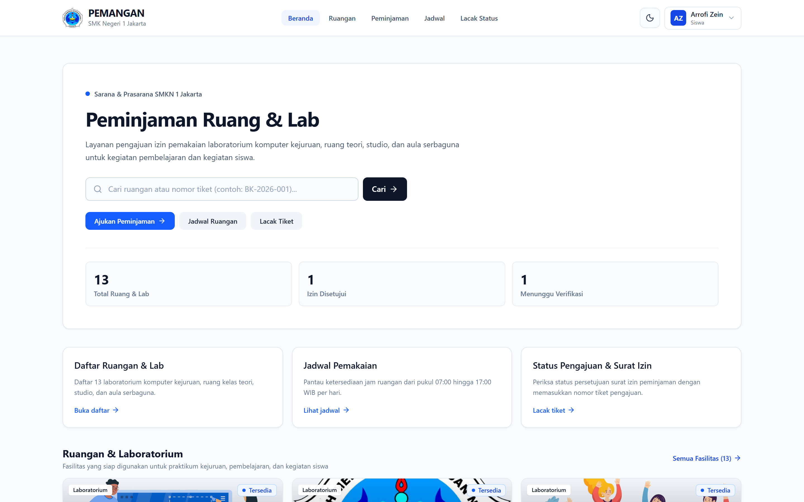 | 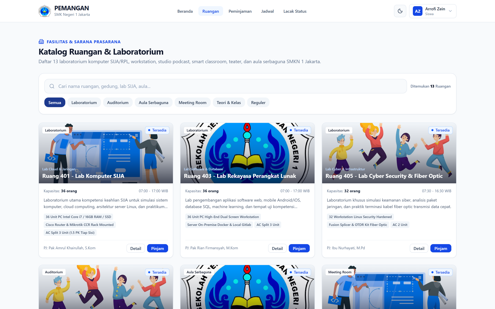 |

| Spesifikasi Ruangan & Inventaris Lab | Matriks Jadwal Per-Jam (07:00–17:00) |
|:---:|:---:|
| 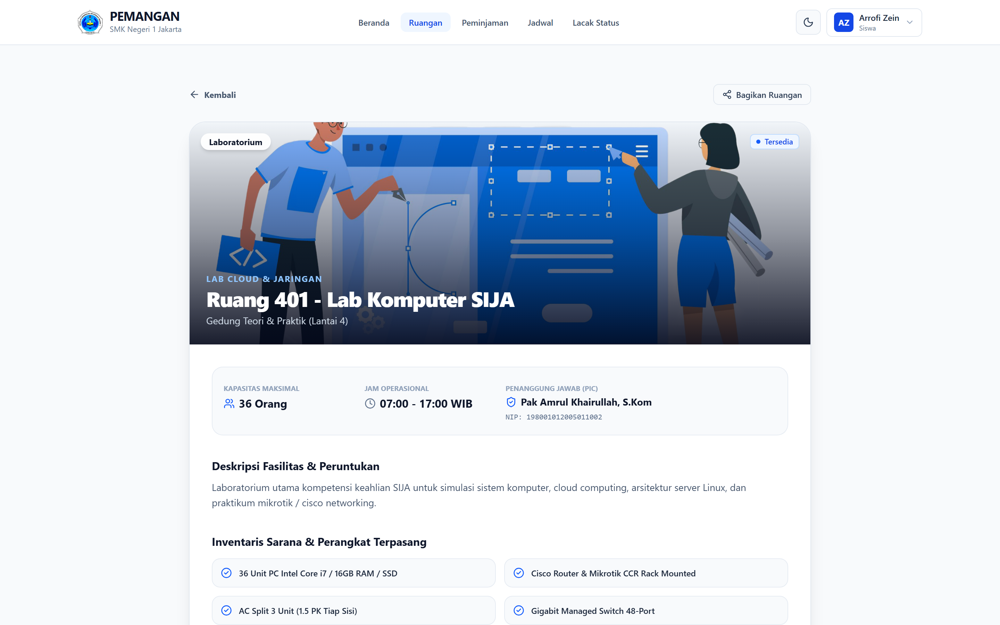 | 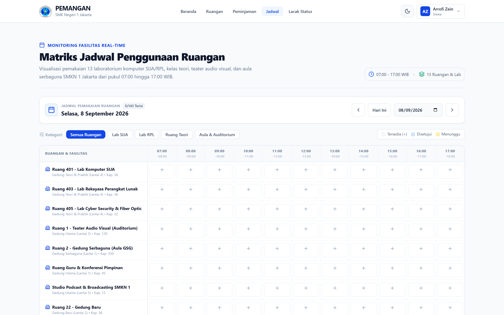 |

| Wizard Peminjaman 4-Langkah Terintegrasi | Pelacakan Tiket Mandiri Realtime |
|:---:|:---:|
| 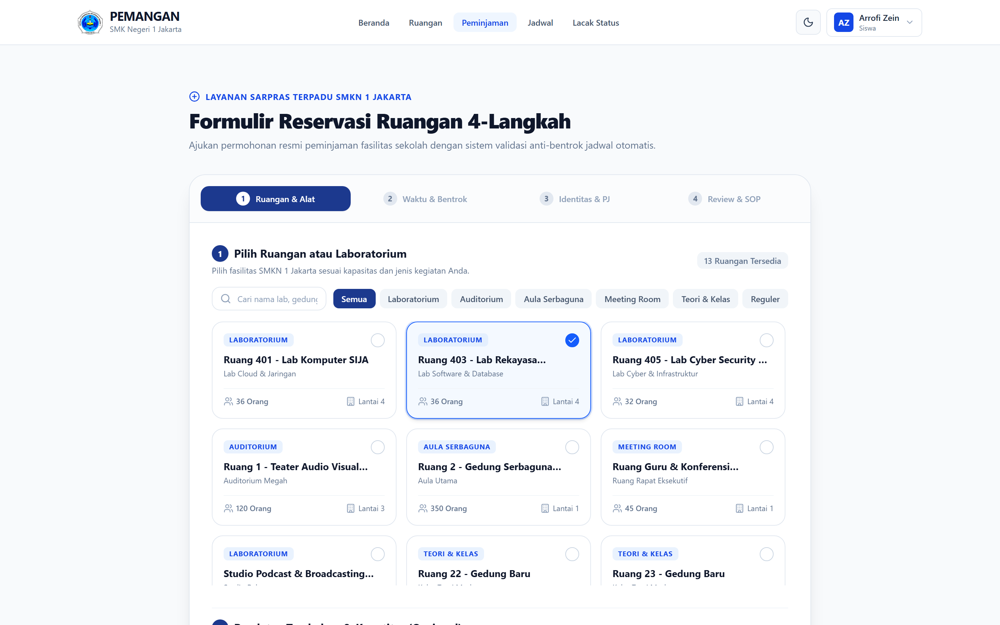 | 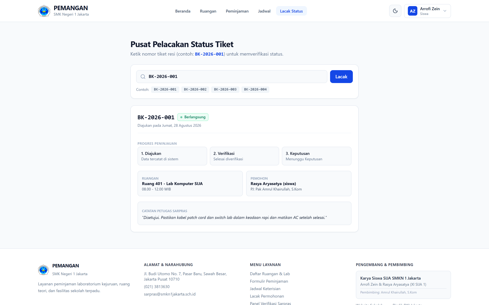 |

| Command Center Pengelola Sarpras (Admin) | Surat Izin Resmi Standar Cetak A4 |
|:---:|:---:|
| 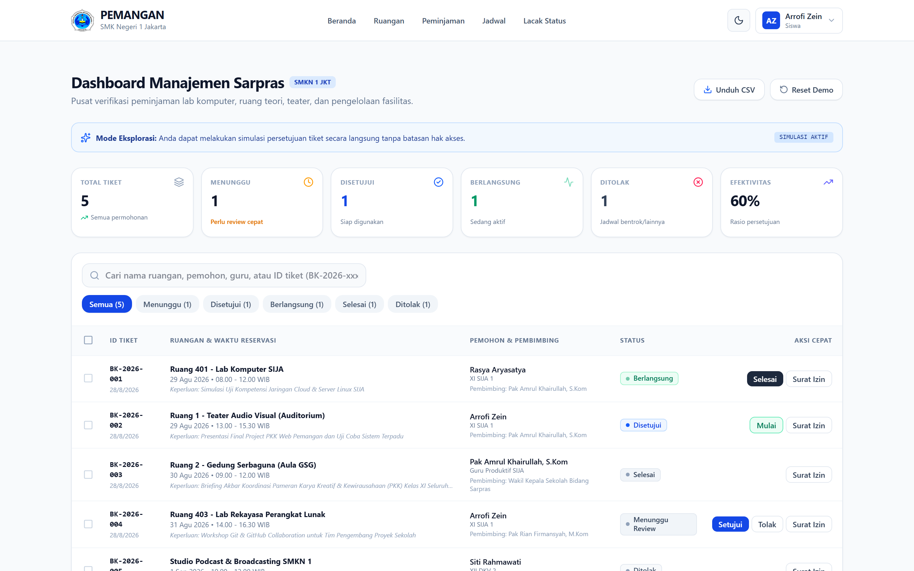 | 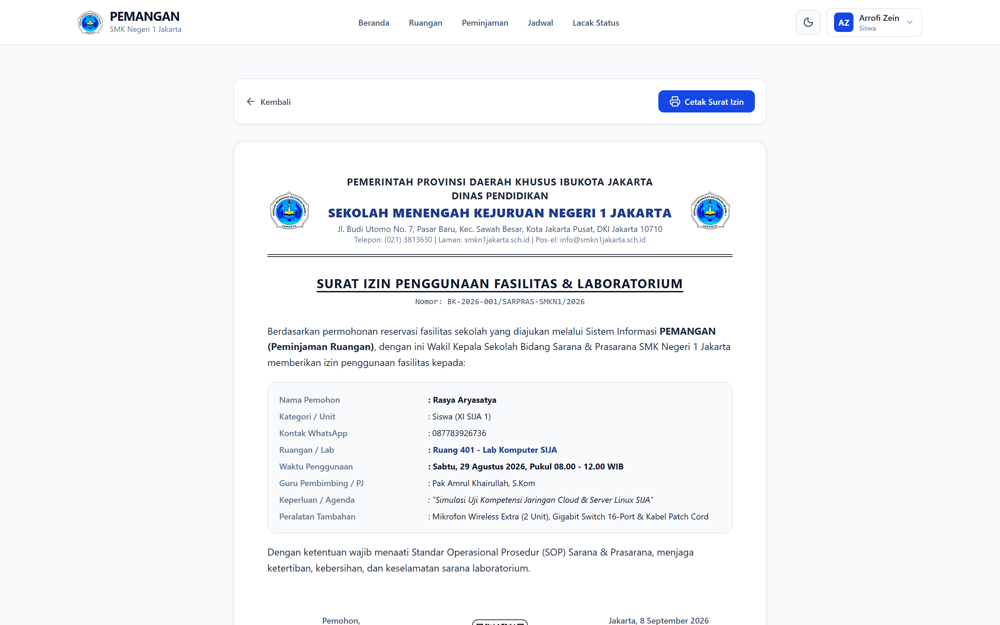 |

</div>

### 2. Tampilan Mobile (Smartphone)

<div align="center">

| Splash Screen Intro | Beranda Utama Mobile | Katalog Ruangan Mobile | Wizard Reservasi Mobile |
|:---:|:---:|:---:|:---:|
| 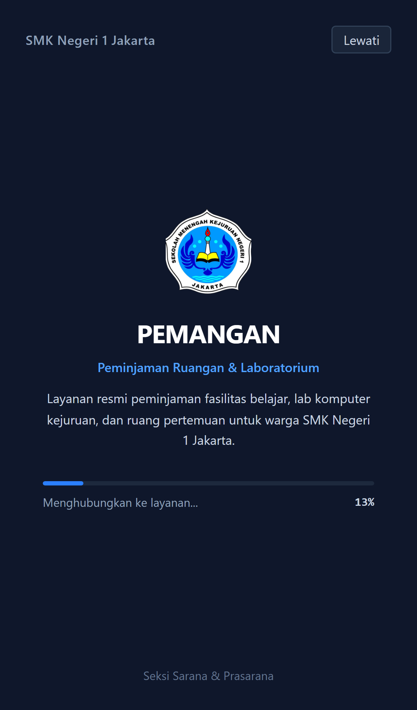 | 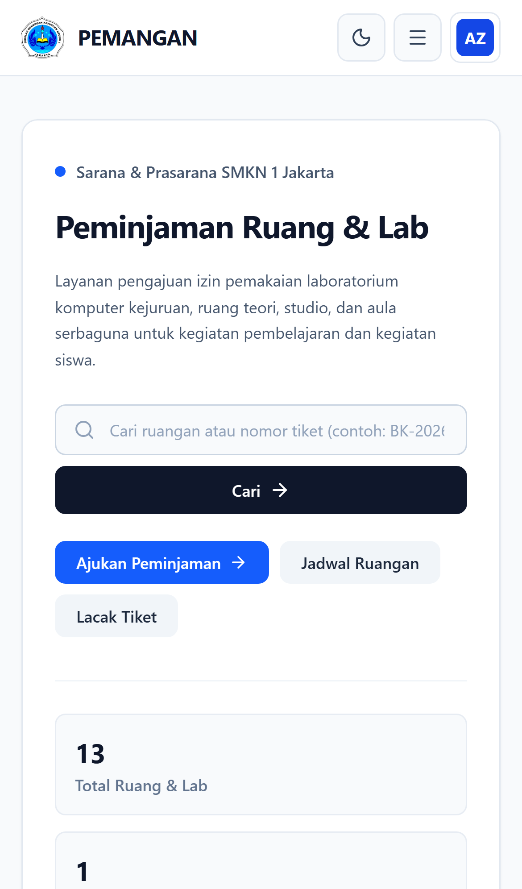 | 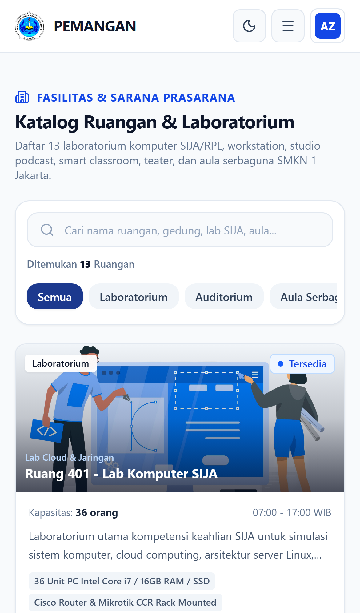 | 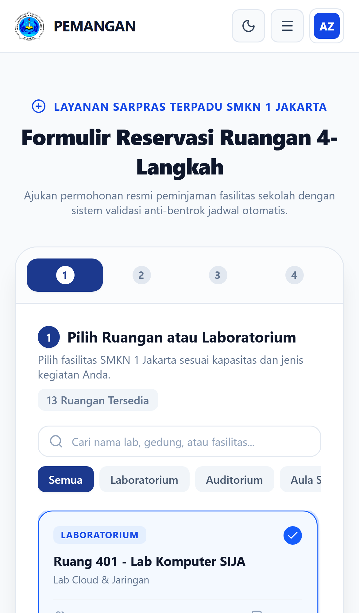 |

| Jadwal Matriks Mobile | Pelacakan Tiket Mobile | Command Center Mobile | Portal Autentikasi Mobile |
|:---:|:---:|:---:|:---:|
| 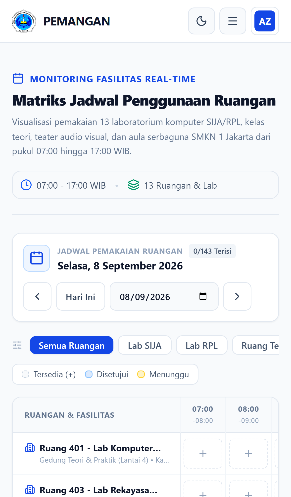 | 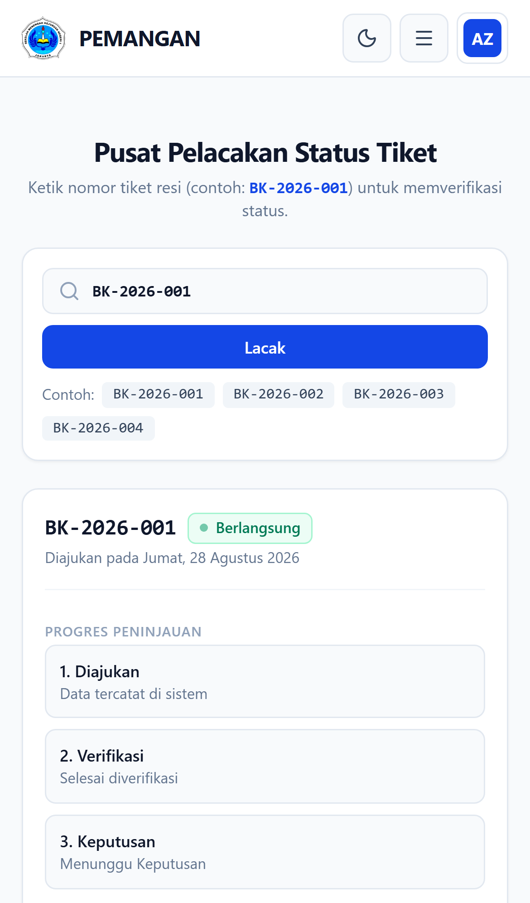 | 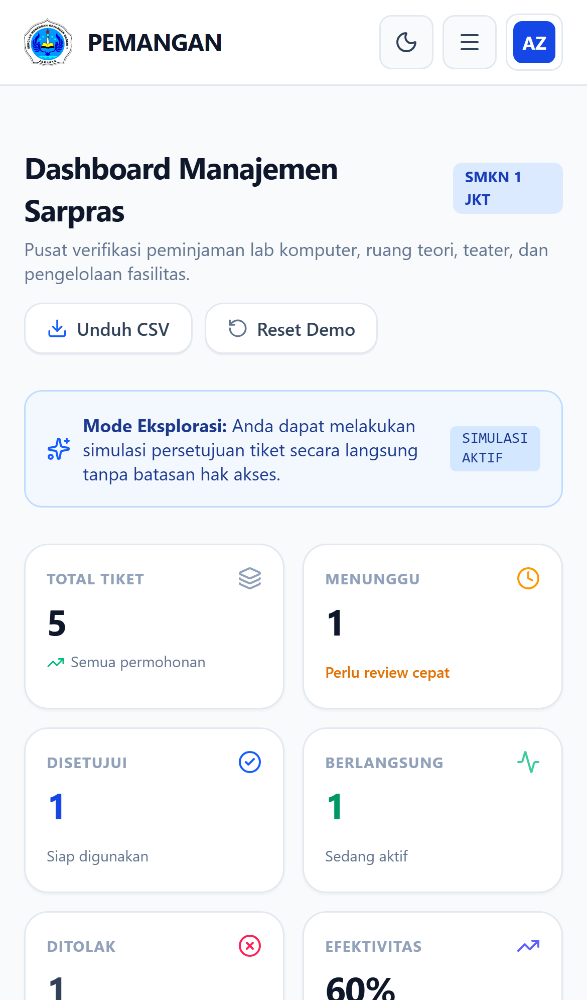 | 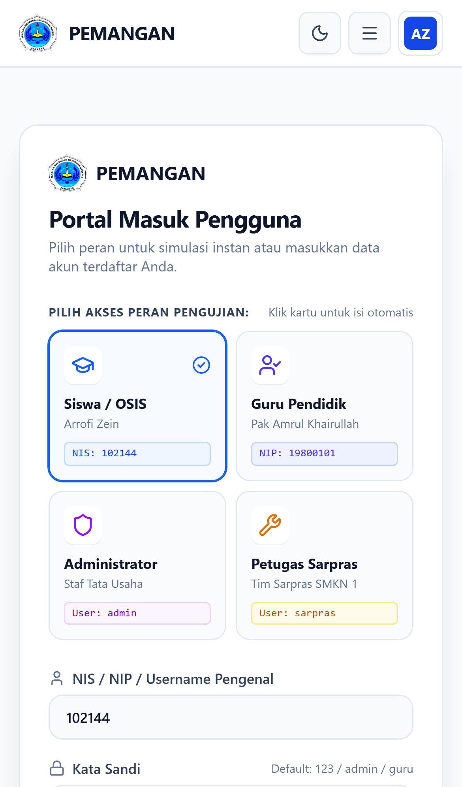 |

</div>

---

## 🔄 Alur Kerja Sistem

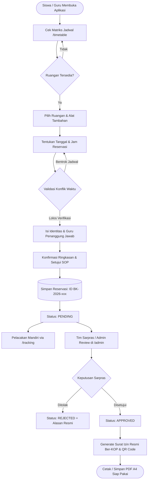

---

## 🛠 Arsitektur & Tech Stack

```text
┌────────────────────────────────────────────────────────────────────────┐
│                          PRESENTATION LAYER                            │
│  React 19  •  TypeScript 5.7/7.0  •  Tailwind CSS v4  •  Lucide Icons │
├────────────────────────────────────────────────────────────────────────┤
│                          APPLICATION LAYER                             │
│  React Router DOM v7 (SPA)  •  Context API (Auth, Theme, Storage)      │
│  Conflict Detection Engine  •  Dynamic QR Generator  •  Canvas Confetti│
├────────────────────────────────────────────────────────────────────────┤
│                          PERSISTENCE LAYER                             │
│  LocalStorage Web Storage API (Auto-Sync & Seed Data Resetter)         │
├────────────────────────────────────────────────────────────────────────┤
│                          INFRASTRUCTURE LAYER                          │
│  Vercel Edge Network (Active Live)  •  Nginx Reverse Proxy Ready       │
└────────────────────────────────────────────────────────────────────────┘
```

| Modul | Pustaka / Alat | Versi | Peran & Implementasi |
|---|---|---|---|
| **Core Framework** | React | `^19.2.8` | Komponen UI reaktif, arsitektur hooks modern |
| **Type Safety** | TypeScript | `^7.0.2` | Kontrak tipe data ketat, mencegah error saat runtime |
| **Bundler & Dev** | Vite | `^8.2.2` | Lightning-fast HMR, kompilasi rollup aset produksi |
| **Routing** | React Router DOM | `^7.18.3` | SPA client-side routing dengan penanganan scroll otomatis |
| **Styling** | Tailwind CSS | `^4.3.3` | Utility-first CSS generasi terbaru dengan `@custom-variant dark` |
| **Ikon Antarmuka** | Lucide React | `^1.37.0` | Ikonografi SVG resolusi tinggi dan ringan |
| **Verifikasi Fisik** | QRCode | `^1.5.4` | Pembuatan QR Code dinamis untuk validasi surat izin |
| **Micro-Interactions**| Canvas Confetti | `^1.9.4` | Feedback visual selebrasi saat reservasi berhasil diajukan |
| **Automated Testing** | Playwright | `^1.62.1` | Suite uji E2E antarmuka, mobile viewport, dan alur bisnis |
| **Hosting & CDN** | Vercel | Production | Global CDN dengan edge rewrites untuk React SPA |

---

## 🏢 Katalog Fasilitas Ruangan (13 Ruangan Aktif)

SMK Negeri 1 Jakarta mengelola 13 ruangan dan laboratorium kejuruan yang siap dipinjam melalui platform:

| ID Ruangan | Nama Fasilitas | Lokasi Gedung | Kapasitas | Penanggung Jawab Lab / PIC | Fasilitas Kunci |
|:---:|:---|:---|:---:|:---|:---|
| `r-401` | **Lab Komputer SIJA** | Lantai 4 | 36 Siswa | Pak Amrul Khairullah, S.Kom | 36 PC Core i7, Mikrotik Router, Server Rack |
| `r-403` | **Lab Rekayasa Perangkat Lunak** | Lantai 4 | 36 Siswa | Pak Rian Firmansyah, M.Kom | 36 PC Core i5, Dual Monitor, Smart Board |
| `r-405` | **Lab Cyber Security & Fiber Optic**| Lantai 4 | 32 Siswa | Ibu Nurhayati, M.Pd | Splicer Fiber Optic, OTDR, Cisco Switch |
| `r-teater` | **Ruang 1 - Teater Audio Visual** | Gedung Utama Lt 3 | 120 Kursi | Ibu Dra. Endang Lestari | Proyektor Laser 5000 Lumens, Sound Cinema |
| `r-serbaguna` | **Ruang 2 - Gedung Serbaguna (Aula)**| Gedung GSG Lt 1 | 350 Orang | Waka Bidang Sarpras | Panggung Utama, Sound System Gantung, AC Sentral |
| `r-guru` | **Ruang Konferensi & Rapat Pimpinan**| Gedung Utama Lt 1 | 45 Orang | Koordinator Tata Usaha | Meja Konferensi Oval, Video Conference Polycom |
| `r-podcast` | **Studio Podcast & Multimedia** | Gedung Utama Lt 3 | 15 Orang | Pak Budi Hartono, S.Kom | Mic Condenser Rode, Audio Mixer, Green Screen |
| `r-22` | **Ruang 22 - Kelas Teori Kejuruan** | Gedung Baru Lt 2 | 36 Siswa | Pak Sukirman, S.Pd | Whiteboard Kaca, Proyektor Fixed, AC Split |
| `r-23` | **Ruang 23 - Kelas Teori Reguler** | Gedung Baru Lt 2 | 36 Siswa | Ibu Nurhayati, M.Pd | Meja Siswa Standar Ergonomis, Audio Speaker |
| `r-24` | **Ruang 24 - Smart Classroom** | Gedung Baru Lt 2 | 40 Siswa | Pak Budi Hartono, S.Kom | Smart TV Interactive 65", Wireless Display |
| `r-25` | **Ruang 25 - Hybrid Network Class** | Gedung Baru Lt 2 | 36 Siswa | Pak Dedi Prasetyo, S.T | 36 Port Gigabit LAN, Gigabit Wi-Fi 6 AP |
| `r-15` | **Ruang 15 - Gedung Lama (Kelas Asri)**| Gedung Lama Lt 1 | 32 Siswa | Ibu Sri Wahyuni, S.Pd | Sirkulasi Udara Alami, Display Mading Kelas |
| `r-16` | **Ruang 16 - Ruang Organisasi (OSIS)**| Gedung Lama Lt 1 | 32 Siswa | Pak Hendra Gunawan, S.Pd | Meja Diskusi Rapat, Lemari Arsip Organisasi |

---

## 🔑 Akun Demo Pengujian Instan

Aplikasi menyediakan tombol **Bypass / Quick-Login** pada halaman `/login` untuk pengujian cepat berbagai hak akses:

```text
┌────────────────────────────────────────────────────────────────────────────────────────┐
│                                 KREDENSIAL PENGUJIAN                                   │
├────────────┬──────────────────┬─────────────┬──────────────────────────────────────────┤
│ Peran      │ Username / NIP   │ Kata Sandi  │ Hak Akses & Privilese                    │
├────────────┼──────────────────┼─────────────┼──────────────────────────────────────────┤
│ 👨‍🎓 Siswa   │ 102144           │ 123         │ Reservasi 4 langkah, tracking, print slip│
│ 👨‍🏫 Guru    │ 19800101         │ 123         │ Pengajuan prioritas, pembimbing kegiatan │
│ 🛡️ Admin   │ admin            │ admin123    │ Full Control Sarpras: ACC/Tolak, CSV, KPI│
│ 🏢 Sarpras │ sarpras          │ sarpras123  │ Validasi teknis ketersediaan fasilitas   │
└────────────┴──────────────────┴─────────────┴──────────────────────────────────────────┘
```

---

## 📂 Struktur Direktori Proyek

```text
Pemangan/
├── docs/
│   └── screenshots/              # Aset visual dokumentasi antarmuka
├── public/
│   ├── img/                      # Logo resmi SMKN 1 Jakarta & foto fasilitas
│   ├── favicon.ico
│   └── robots.txt
├── src/
│   ├── components/
│   │   ├── booking/              # Wizard reservasi 4-langkah
│   │   │   ├── StepRoomEquipment.tsx
│   │   │   ├── StepDateTime.tsx
│   │   │   ├── StepIdentity.tsx
│   │   │   └── StepSummary.tsx
│   │   ├── common/               # Komponen atomik UI (Badge, Modal, KopSurat, Splash)
│   │   ├── layout/               # Navigasi atas, mobile bottom bar, dan footer
│   │   ├── rooms/                # Komponen kartu & filter pencarian ruangan
│   │   ├── slip/                 # Modal surat izin resmi ber-QR Code
│   │   └── timetable/            # Matriks horizontal jadwal per-jam (07:00–17:00)
│   ├── context/
│   │   ├── AuthContext.tsx       # State otentikasi & sesi pengguna
│   │   ├── StorageContext.tsx    # Engine reservasi, anti-bentrok, & analytics
│   │   └── ThemeContext.tsx      # Pengatur preferensi dark/light mode
│   ├── data/
│   │   └── mockData.ts           # Dataset awal 13 ruangan, peralatan, & peminjaman
│   ├── pages/
│   │   ├── HomePage.tsx          # Beranda utama & pelacak kilat
│   │   ├── RoomsPage.tsx         # Katalog lengkap fasilitas sekolah
│   │   ├── RoomDetailPage.tsx    # Detail spesifikasi ruangan tunggal
│   │   ├── BookingPage.tsx       # Wizard formulir pengajuan reservasi
│   │   ├── TimetablePage.tsx     # Monitoring jadwal harian sekolah
│   │   ├── TrackingPage.tsx      # Pusat lacak status tiket mandiri
│   │   ├── AdminPage.tsx         # Command Center Sarpras & ekspor CSV
│   │   ├── LoginPage.tsx         # Portal masuk multi-role & showcase lab
│   │   └── SlipPrintPage.tsx     # Dokumen dinas A4 siap cetak / PDF
│   ├── types/
│   │   └── index.ts              # Definisi interface & tipe data TypeScript
│   ├── App.tsx                   # Central router & frame layout
│   ├── index.css                 # Konfigurasi Tailwind v4 & style cetak A4
│   └── main.tsx                  # Entry point React 19
├── test-scripts/                 # Suite skrip pengujian otomatis Playwright
│   ├── test-modern-stack.js      # Uji 9 alur utama secara headless
│   ├── test-mobile-3color.js     # Uji viewport iPhone & theme toggle
│   └── generate-readme-screenshots.js # Regenerasi screenshot beresolusi tinggi
├── vercel.json                   # Konfigurasi rewrite SPA untuk Vercel
├── vite.config.ts                # Konfigurasi bundler Vite & alias path
├── tsconfig.json                 # Konfigurasi kompilasi TypeScript
└── package.json                  # Definisi dependensi & skrip NPM
```

---

## 🚀 Panduan Instalasi & Deployment

### A. Deployment ke Vercel (Production)

Aplikasi telah dikonfigurasi untuk siap jalan di **Vercel** dengan rewrite SPA pada file `vercel.json`:

```json
{
  "rewrites": [{ "source": "/(.*)", "destination": "/index.html" }]
}
```

Deploy instan menggunakan Vercel CLI:
```bash
# 1. Login atau gunakan token Vercel
npx vercel --token <TOKEN_VERCEL> --prod --yes
```
Aplikasi langsung aktif pada domain: **`https://pemangan.vercel.app`**.

---

### B. Menjalankan Lokal (Development)

#### Kebutuhan Sistem:
- **Node.js**: versi 18.x, 20.x, atau 22.x LTS
- **npm** atau **pnpm**

#### Langkah-langkah:
```bash
# 1. Clone repositori dari GitHub
git clone https://github.com/h1ntz0/Pemangan.git
cd Pemangan

# 2. Instal seluruh dependensi proyek
npm install

# 3. Jalankan server pengembangan Vite lokal
npm run dev
```
Buka peramban dan akses alamat `http://localhost:3000`.

#### Build Produksi Lokal:
```bash
# Kompilasi TypeScript dan bundel Vite
npm run build

# Pratinjau hasil build secara lokal (port 4173)
npm run preview
```

---

### C. Nginx Reverse Proxy (Server Fisik / Intranet Sekolah)

Jika di-hosting pada server lokal SMK Negeri 1 Jakarta menggunakan Nginx:

```nginx
server {
    listen 80;
    server_name pemangan.smkn1jakarta.sch.id;
    root /var/www/pemangan/dist;
    index index.html;

    # Caching aset build Vite
    location /assets/ {
        expires 1y;
        add_header Cache-Control "public, immutable";
    }

    # SPA Fallback routing (React Router v7)
    location / {
        try_files $uri $uri/ /index.html;
    }

    # Penanganan gambar publik
    location /img/ {
        try_files $uri =404;
    }
}
```

---

## 🧪 Pengujian Otomatis (Playwright E2E)

Suite pengujian otomatis disertakan untuk memvalidasi alur bisnis, pencegahan bentrok jadwal, dan responsivitas tampilan perangkat:

```bash
# 1. Menjalankan verifikasi headless 9 alur utama (Vite Preview)
node test-scripts/test-modern-stack.js

# 2. Menjalankan verifikasi mobile viewport (iPhone 14) & switch tema
node test-scripts/test-mobile-3color.js

# 3. Mengambil ulang screenshot dokumentasi secara otomatis
node test-scripts/generate-readme-screenshots.js
```

---

## 📜 Standar Dokumen & Legalitas Cetak

Surat Izin Peminjaman yang diterbitkan melalui `/slip/:id` dirancang sesuai dengan:
1. **KOP Surat Resmi**: Mengacu pada Tata Naskah Dinas Pendidikan Provinsi DKI Jakarta.
2. **Klausul Pertanggungjawaban**: Klausul kepatuhan inventaris, kebersihan, dan keselamatan ruangan yang ditandatangani oleh pemohon dan guru pendamping.
3. **Validasi QR Code**: Menautkan langsung ke data verifikasi online untuk mencegah pemalsuan tanda tangan fisik.
4. **Optimasi CSS Print**: Bebas elemen navigasi (`navbar`, `footer`, `buttons`), margin terstandarisasi `12mm 15mm`, dan kontras tajam untuk printer laser hitam-putih maupun warna.

---

## 👨‍💻 Tim Pengembang

Platform ini dikembangkan dalam rangka **Proyek Kreatif & Kewirausahaan (PKK)** Bidang Keahlian **Sistem Informatika, Jaringan & Aplikasi (SIJA)** di SMK Negeri 1 Jakarta:

| Nama Pengembang | Peran & Kontribusi | Kelas & Jurusan |
|---|---|---|
| **Arrofi Zein** | Lead Frontend & UI/UX Engineer | XI SIJA 1 — SMKN 1 Jakarta |
| **Rasya Aryasatya** | System Architecture & Testing Engineer | XI SIJA 1 — SMKN 1 Jakarta |

- **Guru Pembimbing:** Pak Amrul Khairullah, S.Kom
- **Institusi:** SMK Negeri 1 Jakarta Pusat  
  *Jl. Budi Utomo No. 7, Pasar Baru, Sawah Besar, Jakarta Pusat 10710*

---

<div align="center">

**SMK BISA — SMK HEBAT — SIJA UNGGUL**  
*Mewujudkan Digitalisasi Sarana & Prasarana Sekolah Berkelanjutan*

© 2026 **PEMANGAN**. Dikelola oleh Tim SIJA & Sarpras SMK Negeri 1 Jakarta.

</div>
